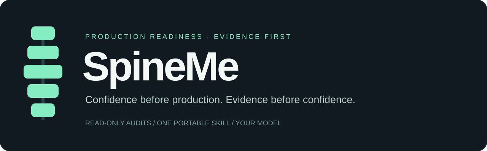

# SpineMe

**Know what could break before you ship.**

SpineMe gives your AI coding assistant a repeatable production-readiness review:
trace the critical flows, find evidence-backed risks, identify blockers, and verify
that fixes actually resolve them.

**Read-only audits · Vendor-neutral model advice · Compact by default**

[Install](#install) · [Usage](#use-it) · [Example report](examples/audit-report.md) · [Full guide](docs/USAGE.md) · [Validation status](VALIDATION.md)

## From reassurance to evidence

“Tests pass” is useful. It does not tell you what happens when a webhook arrives
twice, a migration only partly succeeds, or a provider times out after taking payment.

SpineMe follows the request across the components that make it work—and looks for
where it can fail.

```text
Illustrative report — not a result from your project

Scope: BACKEND ONLY
Backend readiness: NOT READY
Overall production readiness: NOT ASSESSED

PR-001 · HIGH · CONFIRMED · Production blocker: YES
Duplicate fulfillment on callback replay
Evidence: callbacks.py:18–31 processes the same event without deduplication.
Next: inspect PR-001 → prepare remediation → fix separately → verify
```

See the [worked example](examples/audit-report.md) for the hypothetical evidence
and what would count as a verified fix.

## Install

Use one installation method per app. The audit instructions are the same everywhere.
Packages below are built and checked locally; cross-app runtime testing is pending.

### Claude Code

In Claude Code, add this repository as a marketplace:

```text
/plugin marketplace add gleath05/spineme
```

Then send separately:

```text
/plugin install spineme@spineme
```

Select the installed skill (normally `/spineme:spineme`) and ask for a compact audit.
For a session-only trial, `claude --plugin-dir /absolute/path/to/SpineMe-GitHub`
loads the plugin directly. [Claude guide](adapters/claude-code/INSTALL.md).

### Codex

The [Codex adapter](dist/spineme-codex-adapter.zip) installs into your project's
`.agents/skills/spineme/`. Invoke `$spineme` and request your audit.

Or install the plugin from the repository marketplace:

```bash
codex plugin marketplace add gleath05/spineme
codex plugin add spineme@spineme
```

Restart Codex and select the installed SpineMe skill. If your version does not
support CLI plugin installation, install from the app's Plugins Directory after
adding the marketplace. Choose either the skill adapter or plugin, not both.
A [plugin ZIP](dist/spineme-codex-plugin.zip) is also included.
[Codex guide](adapters/codex/INSTALL.md).

### Cursor

Extract the [Cursor plugin](dist/spineme-cursor-plugin.zip). Copy its `spineme`
folder into `~/.cursor/plugins/local/`, reload Cursor, and confirm discovery in
Customize → Skills. For a project-only setup, use the
[Cursor adapter](dist/spineme-cursor-adapter.zip). [Cursor guide](adapters/cursor/INSTALL.md).

### Kiro, Kimi Code, and Grok Build

Extract the appropriate adapter into a temporary folder. Copy **only** its `spineme`
folder into the destination below inside the project you want to audit. Show hidden
files if needed, and compare existing files before replacing them.

| App | Download | Project destination |
| --- | --- | --- |
| Kiro | [Adapter](dist/spineme-kiro-adapter.zip) · [Guide](adapters/kiro/INSTALL.md) | `.kiro/skills/spineme/` |
| Kimi Code | [Adapter](dist/spineme-kimi-code-adapter.zip) · [Guide](adapters/kimi-code/INSTALL.md) | `.kimi-code/skills/spineme/` |
| Grok Build | [Adapter](dist/spineme-grok-build-adapter.zip) · [Guide](adapters/grok-build/INSTALL.md) | `.grok/skills/spineme/` |

Start a new session and ask: **“Use SpineMe. Audit this project. Use compact output.”**

### Any chat app

Attach or paste [SKILL.md](skills/spineme/SKILL.md), provide the code to inspect,
and ask for a SpineMe review of the supplied material. The [chat package](dist/spineme-chat.zip)
includes a starter prompt. Without repository access or execution tools, the review
is limited to what you supply.

## Use it

```text
Use SpineMe. Run a full production readiness audit. Use compact output.
Use SpineMe. Review changes against main. Use compact output.
Use SpineMe. Audit the backend only. Use standard output.
Use SpineMe. Explain finding PR-001 with deep output.
```

| Output | Best for |
| --- | --- |
| **Compact** | Blockers, important findings, gaps, and the next decision |
| **Standard** | Evidence, test results, and important risks across components |
| **Deep** | Detailed investigation of the requested scope |

A scoped audit never claims whole-system readiness. A score never overrides a blocker.

## The workflow

```text
AUDIT → INSPECT FINDING → REMEDIATION HANDOFF → FIX SEPARATELY → VERIFY
```

Ask for `finding PR-001`, then `remediation PR-001`. Implement that handoff in a
separate task. Return with `verify PR-001` and the current code. Keep the original
finding IDs and evidence. These labels express intent; shortcuts vary by app.

SpineMe does not edit implementation, deploy, or change live environments. Safe
builds and tests may generate local artifacts. The host enforces tool permissions;
read-only instructions are not a sandbox.

## Your model, your budget

Start with the least costly model capable of the job. Escalate for a concrete
reason, not a brand name or a severity label.

- **Economy:** bounded inspection and straightforward verification.
- **Balanced:** multi-file, cross-service, and nontrivial root-cause analysis.
- **Advanced:** difficult concurrency, integrity, and high-impact ambiguity.

SpineMe uses your available-model list or your own mapping. It never invents prices,
automatically switches models, or treats a stronger model as a substitute for evidence.

## What gets checked

Backend · frontend · QA · architecture · database · security · jobs and workers ·
integrations · infrastructure · CI/CD · observability · performance · deployment
and recovery · documentation · transaction and data integrity where applicable.

Only relevant technologies are reviewed. Findings are deduplicated by root cause,
with separate severity, evidence confidence, and blocker status.

## Built to be shared

One source of audit behavior: [`skills/spineme/SKILL.md`](skills/spineme/SKILL.md).
Plugin manifests and adapters package it for each host. No runtime server or API key
is required by the skill itself; your chosen assistant has its own requirements.

```bash
python3 scripts/build.py
python3 scripts/check.py
```

The build creates ten ZIPs and checksums. The checks validate structure, archive
contents, local links, and reproducibility. See [CONTRIBUTING.md](CONTRIBUTING.md).

**Status:** local packaging checks pass; cross-host loading and behavioral tests
remain pending. No benchmark or production-safety guarantee is claimed.
[Validation plan](VALIDATION.md) · [Publication setup](docs/PUBLISHING.md).

Repository presentation was inspired by [Ponytail](https://github.com/DietrichGebert/ponytail).
SpineMe has its own audit workflow and does not require Ponytail.

## License and Codex metadata

[MIT](LICENSE) · Copyright © 2026 gleath05.

Codex’s repository catalog lives at [.agents/plugins/marketplace.json](.agents/plugins/marketplace.json).
The leading dot makes `.agents` hidden in some file browsers (on macOS, press
Command–Shift–period to show hidden files). Plugin display settings are in
[`plugin.json`](plugin.json) under `extensions.com.openai.interface`.

After an update, refresh and reinstall the repository plugin:

```bash
codex plugin marketplace upgrade spineme
codex plugin add spineme@spineme
```

Reopen the plugin page or restart the app if it still shows cached metadata.
